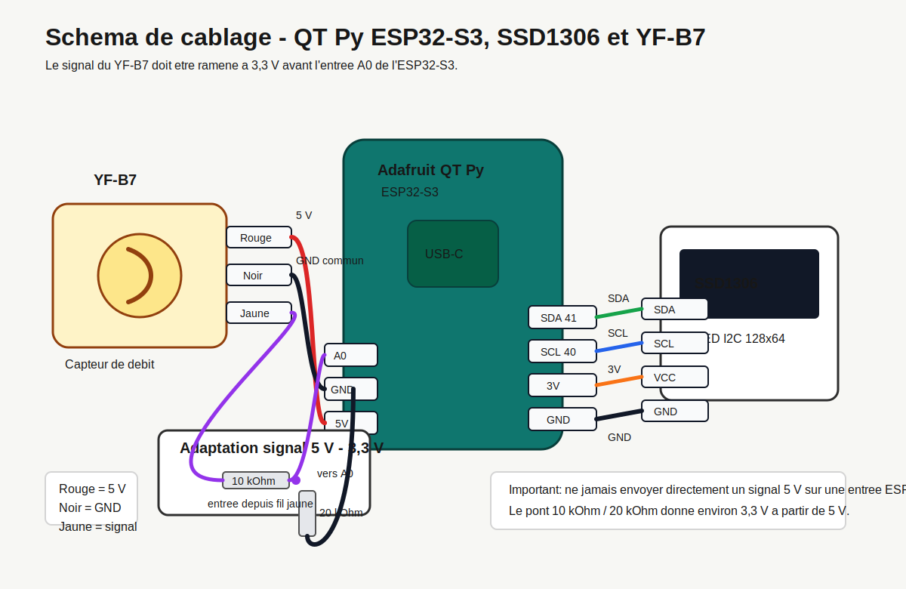

# Debitmetre compact ESP32-S3 QT Py + SSD1306 + YF-B7

Base firmware Arduino/PlatformIO pour afficher le debit et le volume d'eau, avec etalonnage via Wi-Fi.



## Materiel

- Adafruit QT Py ESP32-S3.
- Ecran OLED SSD1306 I2C 128x64, adresse courante `0x3C`.
- Capteur de debit YF-B7.
- Pont diviseur ou convertisseur de niveau logique pour le signal du YF-B7 vers l'ESP32-S3.

## Cablage conseille

### SSD1306 I2C

Le connecteur STEMMA QT du QT Py ESP32-S3 utilise `SCL1 = GPIO40` et `SDA1 = GPIO41` avec `Wire1`.

| SSD1306 | QT Py ESP32-S3 |
| --- | --- |
| VCC | 3V |
| GND | GND |
| SCL | STEMMA QT SCL / GPIO40 |
| SDA | STEMMA QT SDA / GPIO41 |

### YF-B7

| YF-B7 | Raccordement |
| --- | --- |
| Rouge | 5 V |
| Noir | GND commun |
| Jaune | entree `A0` du QT Py via adaptation 5 V -> 3,3 V |

Important: l'ESP32-S3 n'est pas tolerant 5 V. Si le YF-B7 est alimente en 5 V, son signal impulsionnel doit passer par un convertisseur de niveau ou un pont diviseur, par exemple 10 kOhm en serie cote signal et 20 kOhm vers GND pour obtenir environ 3,3 V.

## Calcul

Le YF-B7 est donne avec la relation:

```text
F = 11 * Q
```

Avec:

- `F`: frequence des impulsions en Hz.
- `Q`: debit en L/min.

Le firmware part donc de `K = 11 Hz par L/min`.

## Etalonnage Wi-Fi

Au demarrage, l'ESP32 cree le point d'acces:

```text
SSID: Debitmetre-YFB7
Mot de passe: 12345678
Adresse: http://192.168.4.1
```

La page permet:

- d'afficher le debit instantane en L/min;
- d'afficher le volume total en litres;
- de modifier le facteur `K`;
- de corriger le volume courant;
- de remettre le volume a zero.

Methode simple:

1. Remettre le volume a zero.
2. Faire passer un volume connu, par exemple `1,000 L`.
3. Lire le volume affiche.
4. Corriger le facteur:

```text
nouveau K = ancien K * volume_affiche / volume_reel
```

Exemple: si `K = 11`, que le volume reel est `1,000 L` et que l'affichage indique `0,950 L`:

```text
nouveau K = 11 * 0,950 / 1,000 = 10,45
```

## Compilation et flash

Avec PlatformIO:

```bash
pio run
pio run -t upload
pio device monitor
```

Si la carte PlatformIO n'est pas reconnue chez toi, selectionne l'environnement Arduino ESP32-S3 Adafruit QT Py equivalent dans Arduino IDE et copie `src/main.cpp` dans un sketch `.ino`.
